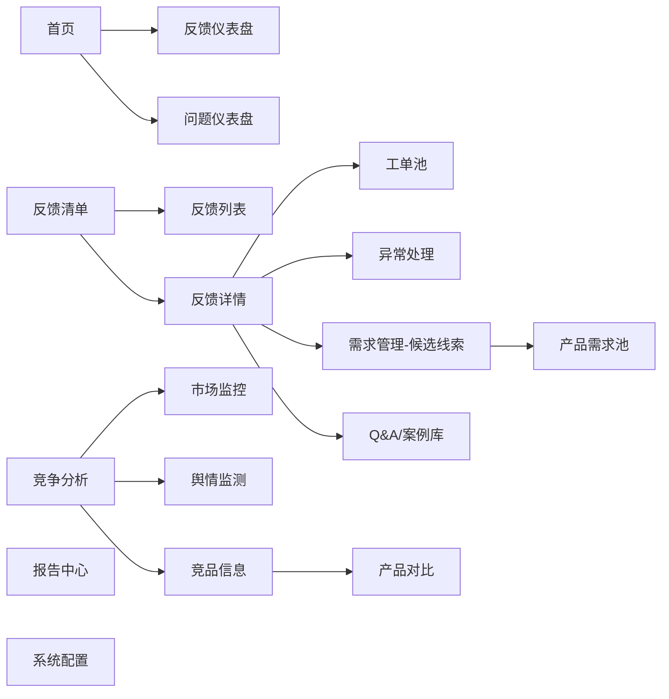
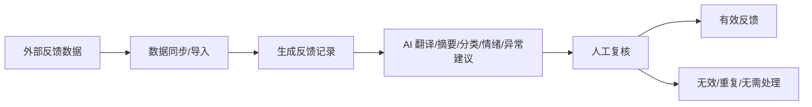
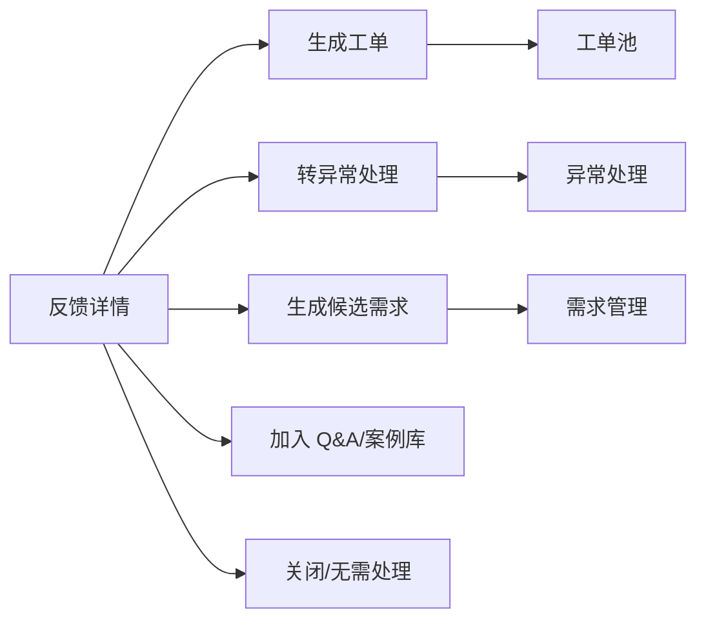
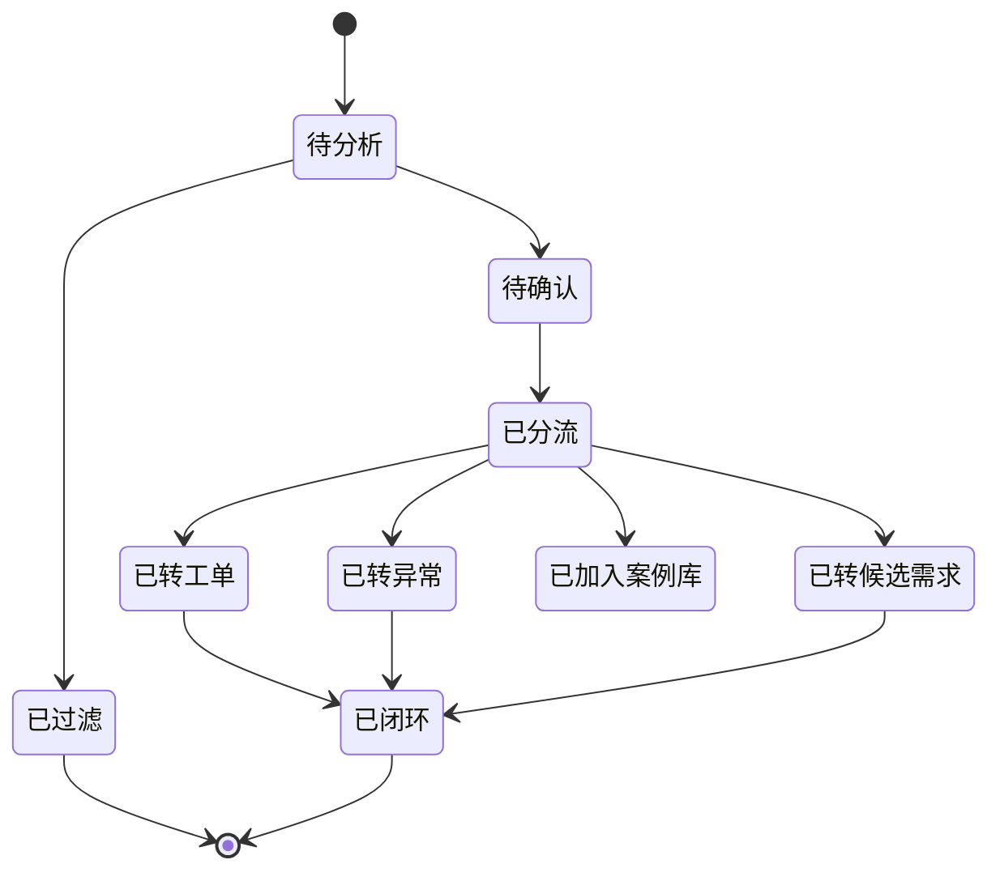
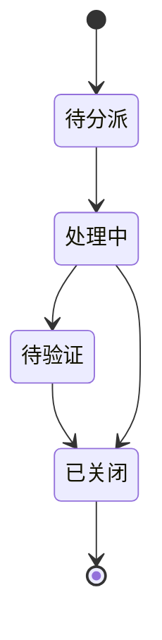
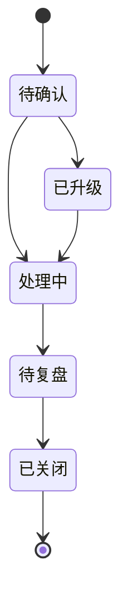
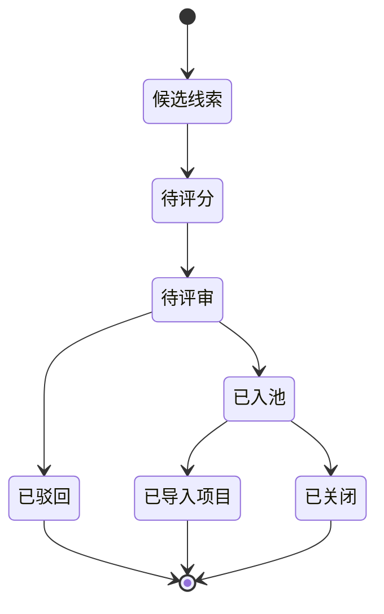

# 反馈管理系统 PRD（研发评审版）

版本：研发评审版  
日期：2026-06-13  
项目：产品快速优化迭代体系 - 反馈分析与需求管理 MVP  
原型目录：`feedback-management-prototype`  
适用对象：研发、产品、测试、数据/AI、系统集成相关人员

## 1. 文档目的

本文档用于指导“反馈管理系统 MVP”的研发评审和后续开发拆解，重点说明：

1. 当前原型所表达的信息架构、页面逻辑和关键交互。
2. 反馈、工单、异常、需求、竞品信息之间的数据关系和状态流转。
3. 系统与外部数据源、内部管理系统、AI 服务之间的对接边界。
4. 一期 MVP 应实现的功能范围、后续预留能力和验收口径。

本文档以当前最新原型界面为主要参考，同时结合《反馈管理系统需求设计说明书-V1.docx》《用户反馈与竞争分析流程0429.xlsx》《反馈分析与需求管理流程0603.xlsx》等项目资料进行整理。

## 2. 原型参考图

以下图片为当前最新原型截图，研发评审时以这些界面作为页面结构、模块边界和交互逻辑参考。

### 2.1 首页 - 反馈仪表盘

### 2.2 首页 - 问题仪表盘

### 2.3 反馈清单 - 列表

### 2.4 反馈清单 - 详情与分流

### 2.5 工单池

### 2.6 异常处理

### 2.7 需求管理

### 2.8 竞争分析 - 市场监控

### 2.9 竞争分析 - 竞品信息

### 2.10 竞争分析 - 产品对比

## 3. 产品定位

反馈管理系统定位为产品快速优化迭代体系中的“反馈入口、分析分流、需求线索、竞争情报”协同平台。

系统承接来自 Amazon、天猫、京东、抖音、APP、客服、售后、退货、投诉、社媒、竞品监控等渠道的信息，经过 AI 辅助处理和人工确认后，形成可追踪的反馈记录、处理工单、异常事件、候选需求、竞品动态和分析报告。

系统不替代完整项目管理系统、生产管理系统或计划管理系统。一期 MVP 的核心价值是把反馈和需求前段管理做清楚，为后续研发立项、质量改进、供应链处理和产品迭代提供结构化输入。

## 4. 用户角色

| 角色 | 主要使用场景 | 一期权限建议 |
|---|---|---|
| 产品经理 | 查看反馈、识别需求、维护需求池、查看竞品 | 全模块查看，需求管理编辑 |
| 运营 | 查看站点反馈、同步平台数据、标记市场变化 | 反馈、竞争分析查看与导入 |
| 售后/客服 | 查看用户原文、补充处理记录、生成工单 | 反馈查看，工单处理 |
| 质量 | 查看质量问题、异常建议、TOP 问题 | 反馈、工单、异常查看与处理 |
| 研发 | 查看需求详情、评分依据、证据材料 | 需求、异常、竞品查看 |
| 供应链/生产 | 查看批次相关问题和异常事件 | 工单、异常查看与处理 |
| 管理层 | 查看仪表盘、闭环率、异常占比、需求分布 | 首页、报告查看 |
| 系统管理员 | 配置分类、权限、接口、AI 参数 | 系统配置管理 |

一期 MVP 可以先实现角色字段和菜单级权限，细粒度数据权限可在后续版本补充。

## 5. 信息架构

## 6. 一期 MVP 范围

| 模块 | 一期实现范围 | 说明 |
|---|---|---|
| 首页 | 反馈仪表盘、问题仪表盘、全局筛选、指标卡、趋势图、TOP 问题 | 支持管理层和产品快速查看整体状态 |
| 反馈清单 | 列表、筛选、详情、AI 字段展示、人工修正、处理去向 | 核心数据入口 |
| 工单池 | 工单列表、状态、责任人、关联反馈 | 一期可做轻量闭环 |
| 异常处理 | 异常列表、P 级、触发来源、状态、责任部门 | 支持 P1/P2/P3 异常识别和跟踪 |
| 需求管理 | 候选线索、产品需求池、五维评分、L1-L4 分级 | 承接反馈转需求 |
| 竞争分析 | 市场监控、舆情监测、竞品信息、产品对比 | 支撑机会识别和竞品分析 |
| 报告中心 | 报告入口和基础导出 | 一期可先做模板化报告 |
| Q&A/案例库 | 入口预留，可先支持加入案例 | 后续扩展知识沉淀 |
| 系统配置 | 分类、渠道、产品、接口配置入口 | 一期最小化配置 |

## 7. 核心业务流程

### 7.1 反馈接收与 AI 预处理

系统应将每条原始反馈沉淀为独立反馈记录，并保留原文、来源、产品、时间、证据链接、AI 处理结果和人工修正结果。

### 7.2 反馈处理分流

同一条反馈允许同时关联多个处理对象。例如一条“无法开机”反馈可生成质量工单，同时作为异常事件证据；一组高频“测脂不准”反馈可进入候选需求。

### 7.3 候选需求到产品需求池

需求评分维度包括用户价值、业务影响、实现可行性、竞争影响、库存影响。分级建议：

| 等级 | 定义 | 典型处理路径 |
|---|---|---|
| L1 紧急修复 | 影响核心功能、安全合规、批量故障或重大投诉 | 异常/质量快速响应，优先修复 |
| L2 体验优化 | 影响体验但不阻断使用 | 纳入短周期优化 |
| L3 功能升级 | 对产品卖点、转化、竞争力有明确提升 | 纳入版本规划 |
| L4 换代开发 | 涉及硬件、算法、结构、平台能力升级 | 进入换代/新品评估 |

## 8. 页面需求

### 8.1 首页

首页用于展示全局经营与质量状态。

#### 页面组成

| 区域 | 功能要求 |
|---|---|
| 全局筛选栏 | 支持时间周期、品牌、站点、产品类型、产品型号、反馈来源筛选 |
| 反馈仪表盘 | 展示退货率、反馈率、闭环率、响应达成率、异常占比、差评率 |
| 问题仪表盘 | 展示一级/二级/三级分类分布、TOP 质量问题、紧急异常动态 |
| 对比维度 | 支持环比、同比展示 |
| 跳转入口 | 紧急异常可跳转异常处理，质量动作可跳转工单池 |

#### 关键逻辑

1. 全局筛选影响首页统计指标和图表。
2. 指标口径需要在系统配置中维护，避免不同角色理解不一致。
3. 首页只展示汇总和趋势，不承载明细处理；明细处理回到反馈清单、工单池、异常处理和需求管理。

### 8.2 反馈清单

反馈清单是系统核心数据池。

#### 列表字段

| 字段 | 说明 |
|---|---|
| 反馈ID | 系统唯一编号 |
| 来源渠道 | 商品评论、退货原因、站内信、客服沟通、APP反馈、社媒等 |
| 品牌/站点/产品类型/销售型号/内部型号 | 产品归属信息 |
| ASIN/SKU | 平台商品标识 |
| 原始反馈摘要 | 用户原文或原文截断 |
| AI 摘要 | AI 生成中文摘要 |
| 一级/二级/三级分类 | 支持 AI 建议和人工修正 |
| 情绪 | 正面、中性、负面 |
| 是否退货 | 是/否 |
| 异常等级建议 | 无、P1建议、P2建议、P3建议 |
| 处理去向 | 工单、异常、候选需求、Q&A、关闭 |
| 反馈时间 | 来源反馈产生时间 |

#### 详情页签

| 页签 | 内容 |
|---|---|
| 原文与证据 | 用户原文、翻译、截图、链接、来源记录 |
| AI 分析 | 摘要、分类、情绪、异常建议、置信度 |
| 处理记录 | 工单、异常、候选需求、Q&A 等关联记录 |
| 相似反馈 | 相似问题聚类和重复反馈提示 |

#### 操作逻辑

1. 用户在列表点击反馈 ID，打开反馈详情抽屉。
2. 用户可在详情中查看原文、证据和 AI 分析。
3. 用户可选择生成工单、转异常、生成候选需求、加入 Q&A。
4. 系统写回反馈记录的处理去向，并建立关联对象。
5. 若用户修改分类、情绪、异常建议，需要记录修改人、修改时间和修改前后值。

### 8.3 工单池

工单池用于承接需要责任部门处理的问题。

#### 字段要求

| 字段 | 说明 |
|---|---|
| 工单ID | 系统唯一编号 |
| 关联反馈ID | 可关联一条或多条反馈 |
| 问题标题 | 由反馈摘要或人工录入生成 |
| 问题分类 | 继承反馈分类，可人工调整 |
| 优先级 | 高、中、低或 P 级映射 |
| 责任部门/责任人 | 处理归属 |
| 状态 | 待分派、处理中、待验证、已关闭 |
| SLA 到期时间 | 响应和处理时限 |
| 处理结论 | 处理措施、验证结果、关闭原因 |

#### 处理逻辑

1. 从反馈详情生成工单时，系统自动带入反馈来源、产品、分类、AI 摘要和证据。
2. 工单需支持责任部门分派、状态流转、处理记录追加。
3. 关闭工单前应至少填写处理结论和验证结果。
4. 工单关闭后反馈记录显示处理完成状态。

### 8.4 异常处理

异常处理用于承接 P1/P2/P3 等需要升级响应的问题。

#### 异常等级

| 等级 | 判定原则 | 处理要求 |
|---|---|---|
| P1 | 安全合规、严重质量、批量故障、重大平台风险 | 立即响应，升级管理层 |
| P2 | 明显影响使用、退货/投诉集中、舆情风险 | 限时响应，形成处理闭环 |
| P3 | 体验问题、偶发问题、需观察趋势 | 进入常规跟踪 |

#### 异常处理逻辑

1. 异常可由 AI 建议、人工转入、工单升级、竞品/市场信号触发。
2. 异常记录需保留触发来源、证据、影响范围、责任部门、处理状态。
3. P1/P2 异常应支持升级提醒和处理时限。
4. 异常关闭前应填写根因、纠正措施、预防措施和复盘结论。

### 8.5 需求管理

需求管理包括候选线索和产品需求池两个层级。

#### 候选线索

候选线索来自反馈详情、相似反馈聚类、竞品机会、市场动态和产品经理手动新增。

| 字段 | 说明 |
|---|---|
| 线索ID | 系统唯一编号 |
| 线索标题 | 问题或机会点概括 |
| 来源类型 | 反馈、竞品、市场、人工、异常 |
| 关联反馈 | 支持多条反馈关联 |
| 产品线/型号 | 影响产品范围 |
| 问题描述 | 痛点和业务背景 |
| 证据材料 | 原文、截图、链接、数据统计 |
| 建议等级 | AI 或人工建议 L1-L4 |
| 当前状态 | 待整理、待评分、已入池、已关闭 |

#### 产品需求池

产品需求池用于承接通过初筛和评分的需求。

| 字段 | 说明 |
|---|---|
| 需求ID | 系统唯一编号 |
| 需求标题 | 面向研发可理解的需求名称 |
| 需求描述 | 用户问题、业务目标、期望结果 |
| 需求等级 | L1/L2/L3/L4 |
| 五维评分 | 用户价值、业务影响、可行性、竞争影响、库存影响 |
| 评分依据 | 数据、案例、竞品、业务影响说明 |
| 处理路径 | 修复、优化、升级、换代、关闭 |
| 关联对象 | 反馈、工单、异常、竞品记录 |
| 评审状态 | 待评分、待评审、已通过、已驳回、已导入项目 |

#### 评分逻辑

| 维度 | 评分关注点 |
|---|---|
| 用户价值 | 是否解决高频痛点、是否影响使用体验 |
| 业务影响 | 是否影响差评、退货、转化、客诉、复购 |
| 实现可行性 | 技术复杂度、供应链影响、成本、周期 |
| 竞争影响 | 是否补齐竞品差距或形成竞争优势 |
| 库存影响 | 是否影响现有库存消化、包装、物料、版本切换 |

系统可给出评分建议，但最终评分和等级由产品经理或评审角色确认。

### 8.6 竞争分析

竞争分析包括市场监控、舆情监测、竞品信息和产品对比。

#### 市场监控

| 功能 | 要求 |
|---|---|
| 监控平台 | 支持 Amazon、天猫、京东、抖音、独立站等 |
| 关键词/排名 | 记录关键词、平台、当前排名、变化、原因 |
| 价格异动 | 记录价格变化幅度和触发等级 |
| 上新/卖点变化 | 记录竞品新增功能、宣传卖点、套装策略 |
| 触发提醒 | 将 L3/L4 机会推送给产品经理评估 |

#### 舆情监测

| 功能 | 要求 |
|---|---|
| 评论情绪 | 正面/中性/负面趋势 |
| 星级分布 | 按平台和产品统计 |
| 高频观点 | 提炼用户关注点、痛点和卖点 |
| 典型评论 | 保留评论摘要和证据链接 |

#### 竞品信息

竞品信息应沉淀为结构化产品档案，字段包括：

| 分类 | 字段 |
|---|---|
| 基础档案 | 品牌、产品名称、型号、竞品类型、产品类型、定位、上市时间 |
| 价格与评价 | 官方售价、到手价、评分、评论数、平台 |
| 硬件规格 | 电极数量、称重范围、分度值、尺寸、材质、显示方式 |
| 测量与算法 | 测量指标、频段能力、用户识别、适用人群、核心卖点 |
| 连接与数据 | App、连接方式、供电方式、数据同步、生态兼容 |
| 包装售后 | 包装清单、认证信息、质保政策、证据来源、待补充项 |
| 痛点与风险 | 用户痛点、负面评论、合规风险、待验证信息 |

#### 产品对比

1. 用户在竞品卡片点击“对比”后打开产品对比抽屉。
2. 对比抽屉最多支持选择 4 个产品。
3. 已选产品在其他选择框中应置为不可重复选择。
4. 选择不少于 2 个产品后展示对比表。
5. 对比表按基础档案、价格与评价、硬件规格、测量与算法、连接与数据、包装售后、痛点风险分组展示。

### 8.7 报告中心

一期建议实现报告模板和导出入口，至少覆盖：

1. 用户反馈分析统计报告。
2. TOP 问题分析报告。
3. 需求池周报/月报。
4. 竞品动态分析报告。

报告生成的数据来源应可追溯到反馈、工单、异常、需求和竞品记录。

### 8.8 Q&A/案例库

一期可先支持从反馈详情加入案例库，并记录：

| 字段 | 说明 |
|---|---|
| 案例ID | 系统唯一编号 |
| 问题标题 | 用户问题概括 |
| 标准回复 | 客服/售后可复用回复 |
| 适用产品 | 产品线、型号、站点 |
| 证据来源 | 原始反馈、截图、链接 |
| 审核状态 | 待审核、已发布、已下线 |

### 8.9 系统配置

系统配置至少包含：

1. 来源渠道配置。
2. 产品线、品牌、型号、ASIN/SKU 维护。
3. 反馈分类树维护。
4. 异常等级和 SLA 规则。
5. 需求评分维度和等级规则。
6. 用户角色和菜单权限。
7. 外部接口配置和同步日志。
8. AI 处理参数和提示词版本。

## 9. 数据对象

| 对象 | 说明 | 关键关联 |
|---|---|---|
| 反馈记录 | 原始用户反馈和 AI/人工分析结果 | 来源、产品、工单、异常、需求、案例 |
| 工单记录 | 责任部门处理任务 | 反馈、异常、处理记录 |
| 异常记录 | P 级异常事件 | 反馈、工单、复盘 |
| 候选需求 | 从反馈/竞品/市场提炼的需求线索 | 反馈、竞品、需求池 |
| 产品需求 | 进入需求池的正式需求 | 候选需求、评分、审批、项目 |
| 评分记录 | 五维评分明细 | 产品需求、评分人 |
| 竞品产品 | 竞品结构化档案 | 市场动态、产品对比 |
| 市场动态 | 价格、排名、上新、卖点变化 | 竞品产品、候选需求 |
| 舆情记录 | 评论、星级、观点、情绪 | 竞品产品、市场动态 |
| 附件证据 | 图片、链接、文件、截图 | 所有业务对象 |
| 处理日志 | 状态流转和操作记录 | 所有业务对象 |

## 10. 状态流转

### 10.1 反馈状态

### 10.2 工单状态

### 10.3 异常状态

### 10.4 需求状态

## 11. 系统对接

### 11.1 总体对接原则

1. 外部系统只作为数据来源或下游承接方，反馈管理系统负责沉淀结构化中间结果。
2. 所有同步任务必须记录同步时间、来源系统、成功数量、失败数量、失败原因。
3. 外部原始数据不应被覆盖，系统内人工修正应作为独立字段保留。
4. 对接失败不应阻断已有数据查看，但应提示同步异常。

### 11.2 输入类接口

| 来源 | 数据内容 | 对接方式建议 | 进入对象 |
|---|---|---|---|
| Amazon/卖家平台 | 评论、退货原因、站内信、评分、ASIN | API 或定时导入 | 反馈记录 |
| 天猫/京东/抖音 | 评论、售后、订单退货、商品数据 | API 或文件导入 | 反馈记录、市场动态 |
| APP 反馈 | 用户反馈、设备信息、App 版本 | API | 反馈记录 |
| 客服/售后系统 | 沟通记录、问题分类、处理结果 | API 或表格导入 | 反馈记录、工单 |
| 卖家精灵/竞品工具 | 排名、价格、销量估算、关键词 | API 或文件导入 | 市场动态、竞品产品 |
| 飞书文档/多维表格 | 流程表单、人工收集记录、审批记录 | API | 反馈、需求、审批 |

### 11.3 输出类接口

| 目标系统 | 输出内容 | 触发场景 |
|---|---|---|
| 项目管理系统 | 已通过需求、需求等级、评分、证据 | 需求评审通过 |
| 计划管理系统 | 需求排期、版本目标、负责人 | 需求进入版本规划 |
| 生产/质量系统 | 批量质量问题、异常事件、纠正措施 | 工单或异常升级 |
| 飞书/消息群 | 异常提醒、待办、评审通知、报告推送 | P1/P2、待评审、报告生成 |
| 数据仓库/BI | 反馈、工单、异常、需求、竞品指标 | 数据分析和报表 |

### 11.4 同步任务要求

| 能力 | 要求 |
|---|---|
| 定时同步 | 支持按来源配置同步频率 |
| 手动同步 | 页面同步按钮触发单次任务 |
| 增量同步 | 基于来源 ID、时间戳或游标去重 |
| 失败重试 | 记录失败原因，支持重试 |
| 数据映射 | 来源字段映射到统一反馈模型 |
| 审计日志 | 记录同步人、同步时间、影响数据量 |

## 12. AI 能力

一期 AI 可作为辅助能力，不直接替代人工决策。

| 能力 | 输入 | 输出 | 人工确认点 |
|---|---|---|---|
| 翻译 | 用户原文 | 中文翻译 | 可编辑 |
| 摘要 | 原文、上下文 | 反馈摘要 | 可编辑 |
| 分类建议 | 原文、产品、历史分类 | 一级/二级/三级分类 | 必须可修正 |
| 情绪识别 | 原文、评分 | 正面/中性/负面 | 可修正 |
| 异常等级建议 | 反馈内容、频次、退货、投诉 | P1/P2/P3/无 | 必须人工确认 |
| 相似反馈聚类 | 文本向量、产品、分类 | 相似问题组 | 可拆分/合并 |
| 需求建议 | 聚类、竞品、业务指标 | 候选需求建议内容 | 必须人工确认 |
| 报告生成 | 统计数据、典型案例 | 报告建议内容 | 必须审核 |

AI 输出需记录模型版本、提示词版本、置信度、生成时间和人工修正结果。

## 13. 非功能要求

| 类别 | 要求 |
|---|---|
| 性能 | 列表分页加载，常用筛选 3 秒内返回 |
| 可追溯 | 所有分流、评分、审批、关闭动作记录日志 |
| 安全 | 按角色控制菜单和操作权限，不输出敏感凭据 |
| 数据质量 | 来源数据、AI 字段、人工字段分层保存 |
| 可配置 | 分类、等级、评分、SLA、来源渠道可配置 |
| 可扩展 | 预留外部系统接口和 AI 能力扩展 |
| 导出 | 支持 Excel/Markdown/PDF 或飞书文档输出，具体格式待确认 |

## 14. 一期验收标准

| 模块 | 验收点 |
|---|---|
| 首页 | 可按筛选条件查看反馈和问题看板 |
| 反馈清单 | 可查看、筛选、打开详情、修正分类、执行分流 |
| 工单池 | 可生成工单、查看状态、更新处理结果 |
| 异常处理 | 可生成异常、标记等级、记录处理过程 |
| 需求管理 | 可从反馈生成候选需求，完成评分和等级确认 |
| 竞争分析 | 可维护竞品信息，完成至少 2 个产品对比 |
| 系统对接 | 至少完成一种反馈来源导入和同步日志记录 |
| AI 辅助 | 至少完成摘要、分类建议、异常建议的字段展示与人工修正 |
| 权限 | 至少支持菜单级角色权限 |
| 日志 | 关键状态流转可追溯 |

## 15. 待研发评审确认事项

| 事项 | 需要确认的问题 |
|---|---|
| 技术架构 | 前端框架、后端框架、数据库、部署环境 |
| 数据来源 | 一期优先接 Amazon、APP、客服系统还是 Excel/飞书导入 |
| 需求池边界 | 是否与现有项目/需求系统双向同步，还是只输出审批后结果 |
| 工单闭环深度 | 一期是否做到完整 SLA 和验证关闭 |
| 异常闭环深度 | P1/P2 是否需要消息提醒和升级审批 |
| AI 服务 | 使用内部模型、外部 API 还是先用规则/人工字段模拟 |
| 附件存储 | 证据截图、链接、原始文件存放位置和权限 |
| 报告格式 | 一期优先导出 Excel、Markdown、PDF 还是飞书文档 |
| 权限粒度 | 菜单级、数据范围、字段级权限是否一期实现 |
