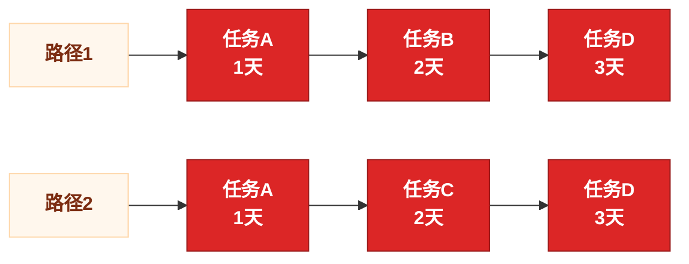

# Critical Path Flowchart Output

Use this reference whenever the user asks for a flowchart, horizontal chart, Mermaid, SVG, PNG, or exported visual for PM Gantt critical paths.

## Required Shape

The flowchart must be:

- Horizontal: left to right.
- Task-only: include `detail_type = 3` tasks only.
- Critical-task-only: include tasks where `whether_critical_task = 1`.
- Path-based: if there is more than one critical path, draw each complete path separately.
- Duration-aware: each node label must include the task name and working-day duration.
- Workday-based: durations must exclude holidays/rest days and include adjusted workdays.
- Actual-aware: if `actual_end_date` exists, use actual duration and mark the node as actual.

Do not include stages, nodes, phase rows, decorative summaries, or non-critical parallel tasks.

## Text Format

For a single path:

```text
任务A（1天）→任务B（2天）→任务C（3天）
```

For multiple paths:

```text
路径1：任务A（1天）→任务B（2天）→任务D（3天）
路径2：任务A（1天）→任务C（2天）→任务D（3天）
```

## Mermaid Format

Use this style when the user wants a flowchart in the chat:



Rules:

- Use `flowchart LR`.
- Do not use `subgraph` for path grouping; many Mermaid renderers lay out subgraph contents vertically even under `flowchart LR`.
- For multiple critical paths, render each path as its own left-to-right chain and prefix the chain with a label node such as `路径1`.
- Use unique node ids per path, even when the same task appears in multiple paths.
- Node label format is `任务名称<br/>N天`; if actual duration was used, label it as `任务名称<br/>N天（实际）`.
- Do not merge branches into one graph if that makes a path ambiguous.

## SVG/PNG Export Format

Use `scripts/export_flow_svg.mjs` after `scripts/analyze_critical_path.mjs`.

Default behavior:

- Export all critical paths.
- Put each path on a separate horizontal row.
- Label each row as `路径1`, `路径2`, etc.
- Use red boxes for critical tasks.
- Use orange arrows between tasks.

Optional behavior:

- Use `--path_index <n>` only when the user asks for one specific path.
- Convert SVG to PNG only if the environment has a supported renderer.
