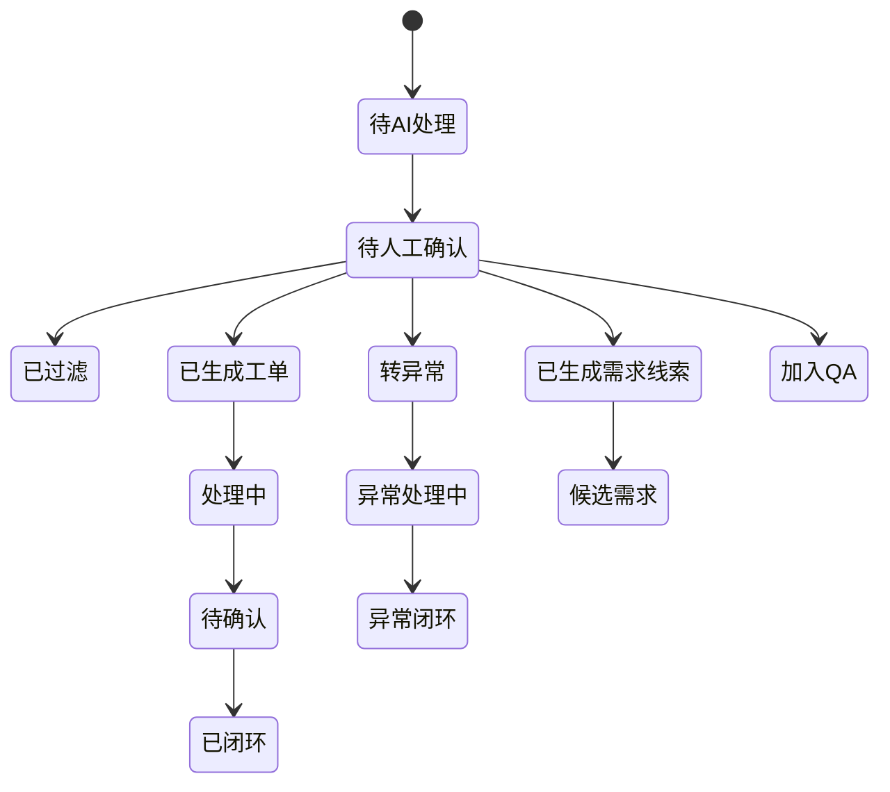
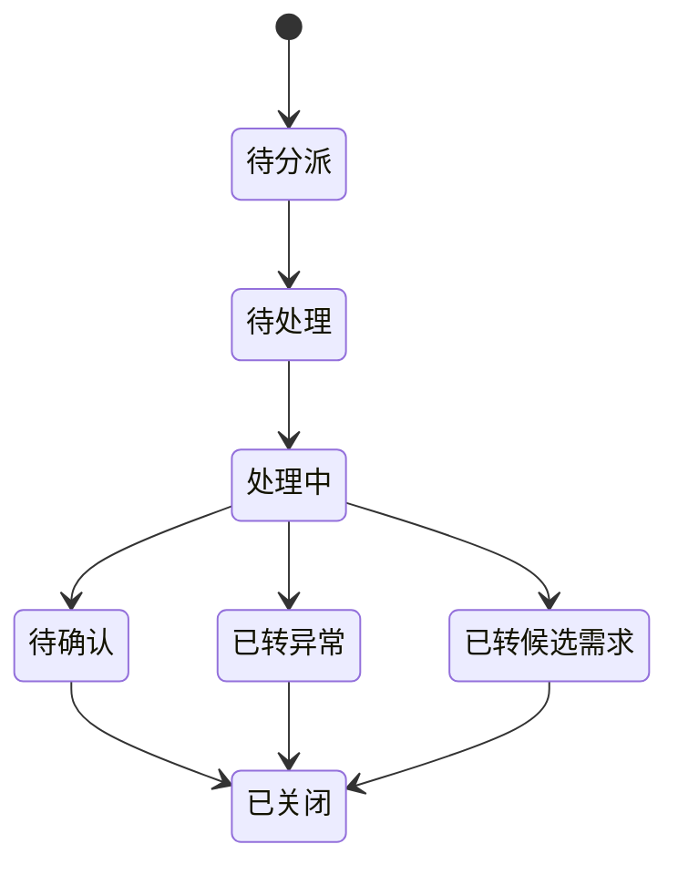
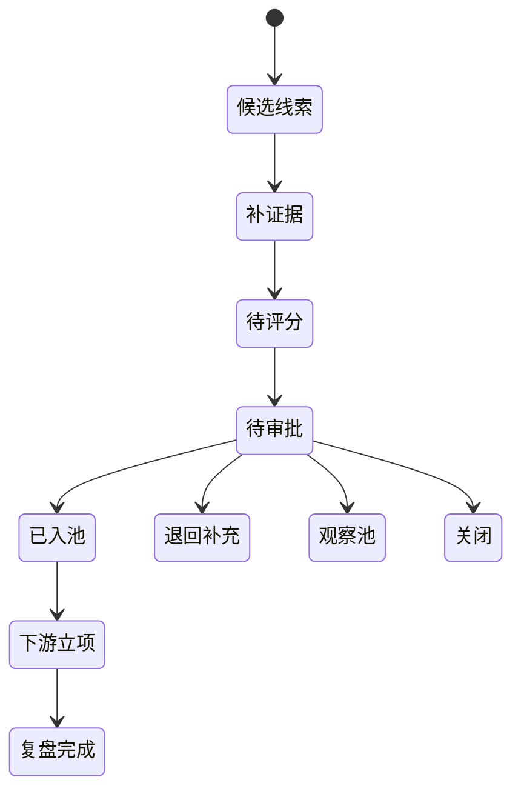

# 反馈管理系统 PRD

版本：V1.0  
日期：2026-06-12  
项目目录：`/Users/handy/codex/produce_iteration_system`  
适用范围：亚马逊美国站 MVP 试运行，后续扩展至国内电商、跨境多站点、线下售后与更多第三方数据源。

## 1. 文档目的

本文档基于现有原型、流程文件和需求说明书，定义“用户与市场反馈管理系统”的产品需求。重点说明系统的软件逻辑、数据闭环、状态流转和外部系统对接方式，作为研发、产品、运营、售后、质量和管理层评审一期 MVP 的依据。

本 PRD 不替代现有流程制度、现有需求池、事件管理系统或项目管理系统。它定义的是反馈管理系统在产品快速优化迭代体系中的前端数据入口、分析处理平台和标准化输出平台。

## 2. 依据资料

| 资料 | 用途 |
|---|---|
| 《反馈管理系统需求设计说明书-V1.docx》 | 系统定位、一期/二期边界、数据对象、接口、权限和验收标准 |
| 《用户反馈与竞争分析流程0429.xlsx》 | 第一流程节点：反馈与市场信息收集、竞品收集与分析、市场端紧急异常处理 |
| 《反馈分析与需求管理流程0603.xlsx》 | 第二流程节点：反馈分析与需求管理 |
| 《反馈分析产生需求流程MVP-0603.xlsx》 | 反馈甄别、需求产生、候选需求记录、异常处理、需求池导入表 |
| 《亚马逊美国站用户信息反馈收集操作指引 (V1.0-202606).docx》 | 亚马逊评论、退货、站内信、投诉、APP反馈、社媒和Vine等来源的采集规则 |
| 《外贸电商异常级别判定标准V1.0.docx》 | P0/P1/P2/P3 异常分级、响应时效和升级路径 |
| `feedback-management-prototype/` | 当前可评审原型：反馈清单、工单池、异常处理、需求管理、竞争分析、仪表盘 |

## 3. 产品定位

反馈管理系统是产品快速优化迭代体系的前端数据入口和反馈闭环平台，负责将用户反馈、市场反馈、竞品信息和异常信息统一纳入管理，经过 AI 处理、人工确认、工单协同、异常处置、需求线索生成和报表分析后，向现有需求池、事件管理、项目管理、计划管理和生产管理系统输出标准化结果。

一期目标：

1. 让反馈从收集、分析、处理到关闭形成可跟踪闭环。
2. 通过系统自动录入、AI 摘要/分类/去重，降低人工整理成本。
3. 建立业务看板、质量看板、竞品看板和周/月报能力，辅助产品迭代决策。
4. 深度对接卖家精灵 API，沉淀竞品、关键词、排名、差评、价格和促销数据。
5. 与 ERP/PMS/售后系统做基础对接，与现有需求池和事件系统预留接口。

二期目标：

1. 与需求池、事件管理、项目管理、计划管理、生产管理深度联动。
2. 建立需求、异常、项目、验证和复盘的跨系统状态同步。
3. 引入相似问题聚类、需求评分建议、自动洞察和策略建议等高级 AI 能力。

## 4. 一期与二期边界

| 层级 | 一期 MVP 能力 | 二期或预留能力 |
|---|---|---|
| 数据采集层 | 海外/国内 ERP 基础对接、APP 反馈对接、手工录入、批量导入、卖家精灵 API 对接 | 更多平台直连、社媒舆情直连、更多第三方竞品数据源 |
| 数据处理层 | 清洗、翻译、摘要、去重建议、三级分类建议、P0-P3 异常建议、竞品指标处理 | 相似问题聚类、需求评分建议、自动洞察、策略建议 |
| 业务应用层 | 反馈清单、工单池、异常处理、需求候选线索、产品需求池导入、竞争分析、Q&A/案例库、仪表盘 | 需求闭环深度联动、复盘机制、跨系统任务自动生成 |
| 对外服务层 | ERP/PMS 基础对接、群机器人通知、现有需求池导入/接口预留 | 事件管理、项目管理、计划管理、生产管理深度联动 |

一期系统负责“反馈与证据沉淀 + 分析判断 + 标准化输出”。正式需求审批、项目立项、计划排产和生产执行仍由现有或后续系统承接。

## 5. 业务流程总览

主流程：

1. 数据进入：平台评论、退货原因、站内信、客服沟通、APP 反馈、社媒、Vine/天使用户、投诉/警告、竞品数据、市场动态进入系统。
2. AI 处理：系统执行翻译、摘要、情绪识别、三级分类建议、去重合并建议、异常等级建议。
3. 人工确认：运营、售后、技术支持或产品经理确认 AI 结果，必要时修正分类、摘要、异常等级和处理去向。
4. 分流处理：反馈可进入工单池、异常处理、候选需求线索或 Q&A/案例库。
5. 工单闭环：普通反馈按责任人、部门和 SLA 处理，形成处理记录和关闭原因。
6. 异常闭环：P0/P1/P2/P3 异常按响应时效、方案时效和升级路径处置。
7. 需求产生：有效反馈、上升趋势、竞品机会和产品异常可形成候选需求线索。
8. 需求管理：候选线索补证据、合并同类项、五维评分后导入产品需求池。
9. 输出沉淀：输出用户反馈分析统计报告、产品需求池导入清单、异常处理跟踪表、竞品分析报告、Q&A/案例。

## 6. 角色与权限

| 角色 | 权限范围 | 关键限制 |
|---|---|---|
| 管理员 | 系统配置、角色权限、接口配置、全量数据查看 | 配置变更必须留痕，不展示密钥明文 |
| 品牌/产品经理 | 负责品牌或产品线的反馈、异常、竞品和需求线索 | 可转需求池，但不替代现有需求池审批 |
| 电商/运营 | 负责渠道反馈、竞品监控、平台异常和处理协同 | 仅查看授权站点、店铺、品牌数据 |
| 售后/客服 | 录入和处理售后反馈、维护 Q&A、查看处理结论 | 不查看无关竞品和管理层敏感看板 |
| 研发/技术支持 | 查看产品相关反馈、异常、根因分析和整改记录 | 只处理分派事项，不直接关闭业务工单 |
| 质量/供应链 | 查看质量异常、批次、整改、验证和供应链相关信息 | 按产品线和异常分派授权 |
| 管理层 | 查看汇总看板、异常趋势、重点问题和迭代成效 | 默认不参与日常工单编辑 |

权限模型采用“角色 + 产品线/品牌/站点/店铺数据范围”。所有接口同步、AI 处理、人工修正、状态变更和关闭动作必须记录操作者、时间和变更前后内容。

## 7. 信息架构与页面模块

当前原型导航包括：首页、反馈清单、工单池、异常处理、需求管理、竞争分析、报告中心、Q&A/案例库、系统配置。

### 7.1 首页

目标：提供管理层和业务负责人查看反馈健康度、质量问题、响应效率和异常风险的入口。

核心功能：

- 支持时间、站点、品牌、产品类型、销售型号、来源渠道筛选。
- 支持业务看板与质量看板切换。
- 展示反馈总量、反馈率、差评率、退货率、AI 去重合并率、已转工单数。
- 展示关键指标趋势，趋势标题跟随时间周期变化。
- 展示一级/二级/三级反馈分类、来源分布、异常分布、TOP 问题、工单漏斗和处理时效。
- 支持从异常提醒、待处理工单、质量问题直接跳转到明细模块。

### 7.2 反馈清单

定位：原始反馈数据池，承接所有来源收集的原始反馈及 AI 处理结果，属于数据层和分析入口，不等同于工单池。

核心字段：

- 反馈ID、来源渠道、站点、品牌、产品类型、销售型号、内部型号、ASIN/SKU、订单号。
- 用户原始反馈、AI 翻译、AI 摘要、附件证据、反馈时间。
- 一级分类、二级分类、三级分类、情绪、是否退货、异常等级建议。
- 处理去向、同步批次、同步时间、新增标识。

核心交互：

- 支持搜索反馈ID、ASIN、型号、原文关键词。
- 支持按列筛选。
- 支持行内快速修改一级/二级/三级分类、情绪、是否退货、异常等级建议。
- 支持查看反馈详情，展示原文、翻译、摘要、产品信息、证据链接和处理步骤。
- 详情动作包括：生成工单、转异常、生成候选需求、加入 Q&A。
- 处理动作需写回反馈主表的“处理去向”。

软件逻辑：

- `生成工单`：创建工单记录，进入工单池，反馈状态写为“已生成工单”。
- `转异常`：创建异常记录，进入异常处理，反馈状态写为“转异常”。
- `生成候选需求`：创建候选需求线索，进入需求管理的“候选线索”页签，反馈状态写为“已生成需求线索”。
- `加入Q&A`：创建知识/案例记录，进入 Q&A/案例库，反馈状态写为“加入Q&A”。

### 7.3 工单池

定位：从反馈清单生成的处理协同事项，按部门、责任人和 SLA 跟踪处理。

核心字段：

- 工单ID、反馈ID、状态、责任部门、责任人、优先级、处理动作、当前处理人、完成时限、SLA 剩余时间、处理结果、关闭原因、是否转异常、是否预留需求。

状态建议：

- 待分派、待处理、处理中、待确认、已关闭、已转异常、已转候选需求。

核心逻辑：

- 工单由反馈动作、批量规则或人工创建产生。
- 工单必须绑定至少一条反馈记录。
- 工单处理过程记录时间轴，包括分派、转交、处理说明、附件、结论、关闭。
- 超过 SLA 自动标红并提醒责任人；P1/P2 超时按异常升级规则提醒上级。
- 工单关闭前必须填写处理结论和关闭原因。

### 7.4 异常处理

定位：承接 P0/P1/P2/P3 产品、平台、合规、客户伤害、运营异常的快速响应和闭环。

异常等级：

| 等级 | 响应时效 | 方案时效 | 处理模式 |
---|---:|---:|---|
| P0 致命/封店 | 30分钟内 | 6小时内 | 立即执行 |
| P1 高危/下架 | 2小时内 | 24小时内 | 紧急处理 |
| P2 中危/体验 | 6小时内 | 72小时内 | 标准SOP |
| P3 低危/常规 | 24小时内 | 常规处理 | 常规流程 |

异常处理字段：

- 异常ID、来源渠道、站点、ASIN/SKU、产品线、内部型号、异常日期、异常现象、异常分类、等级、影响范围、临时处置、主责部门、配合部门、根因结论、整改方案、验证结果、是否转需求、关联候选需求ID、状态、责任人、更新时间。

核心逻辑：

- P0/P1 必须强提醒并记录升级路径。
- P2/P3 可按标准流程处理，但超时需升级提醒。
- 安全、合规、批量质量、功能失效和平台风险应优先进入异常处理，而不是直接进入普通需求。
- 异常关闭前必须完成根因、整改、验证和归档。
- 异常可生成候选需求或进入现有事件管理系统接口预留。

### 7.5 需求管理

定位：承接反馈分析后形成的候选需求线索，完成补证据、合并、评分、分级和导入产品需求池。

页面结构：

- 候选线索
- 产品需求池

候选线索字段：

- 线索ID、来源反馈、分类、线索标题、证据摘要、适用产品、状态、下一步动作。

候选线索操作：

- 合并：合并同类反馈、退货原因、评论、APP反馈、竞品机会。
- 补证据：补充反馈数量、影响范围、趋势、截图/链接、样品或批次信息。
- 进入评分：补齐必要信息后进入五维评分。

产品需求池字段：

- 需求ID、候选来源、需求标题、来源/证据、适用产品、五维评分、等级、处理路径、状态、责任人、完成时限、需求描述、用户痛点、预期价值、风险与待确认、下一步动作、关联记录。

评分维度：

| 维度 | 含义 |
|---|---|
| 用户价值 | 是否解决关键痛点、提升核心体验或降低用户损失 |
| 业务影响 | 是否影响退货率、差评率、转化率、销量、品牌和平台风险 |
| 可行性 | 技术、成本、周期、供应链、验证难度 |
| 竞争影响 | 是否与竞品卖点、价格、排名、评价变化相关 |
| 库存影响 | 是否影响在售库存、包材、批次、售后成本和清库存策略 |

需求等级：

| 等级 | 定义 | 处理路径 |
|---|---|---|
| L1 | 紧急修复：安全、合规、批量质量或高退货风险 | 快速审批，必要时联动异常处理 |
| L2 | 体验优化：高频痛点或满意度问题 | 纳入近期迭代评审 |
| L3 | 功能升级：用户价值和竞争影响明确 | 进入版本规划和资源评估 |
| L4 | 换代开发：中长期机会或平台级能力 | 进入产品规划观察池 |

### 7.6 竞争分析

定位：整合市场动态、舆情监测和竞品产品档案，支撑需求机会识别、产品策略判断和竞品异常提醒。

页面页签：

1. 市场监控：跨平台竞品动态、关键词/排名变化、市场触发提醒。
2. 舆情监测：AI 舆情采集、星级分布、正向观点、负向观点、未满足需求、典型评论与媒体线索。
3. 竞品信息：竞品产品档案、规格参数、核心卖点、用户痛点、产品对比。

竞品产品对比逻辑：

- 最多选择 4 个产品进行对比。
- 采用固定对比槽位，每个槽位一个下拉选择器，避免产品样本过多时页面铺满。
- 对比表按“基础档案、价格与评价、硬件规格、测量与算法/功能能力、连接与数据、包装售后与证据、痛点与风险”分组。
- 不同产品类型字段不完全一致时，不适用字段显示“不适用”，缺失字段显示“待补充”。

### 7.7 报告中心

一期报告类型：

- 用户反馈周报/月报。
- 竞争分析周报/月报。
- 异常统计分析。
- 有效信息转需求清单。

报告生成逻辑：

- 用户可按周期、站点、品牌、产品线、型号生成报告。
- 系统自动汇总反馈总量、有效反馈数、过滤反馈数、异常反馈数、候选需求数、TOP问题、上升趋势、产品异常、竞品/市场机会和建议动作。
- AI 可生成报告初稿，但关键结论需人工确认。

### 7.8 Q&A/案例库

定位：沉淀高频问题、处理话术、异常案例、根因和整改经验。

核心逻辑：

- 反馈详情可一键加入 Q&A/案例库。
- 已关闭工单、异常处理记录可归档为案例。
- Q&A 可被客服和售后复用，但对外回复必须人工确认。

### 7.9 系统配置

配置项：

- 渠道配置、品牌/产品线/型号主数据。
- 反馈三级分类标准。
- 异常等级规则和 SLA。
- 角色权限和数据范围。
- 接口配置与同步频率。
- AI 处理提示词、分类标签和置信度阈值。
- 群机器人和报告推送配置。

## 8. 数据对象模型

| 数据对象 | 说明 | 关键字段 |
|---|---|---|
| 反馈记录 | 所有用户与市场反馈的原始载体 | 反馈ID、来源渠道、站点、ASIN/SKU、产品线、内部型号、销售型号、订单号、原文、翻译、摘要、附件、反馈时间、是否退货、异常等级 |
| 反馈工单 | 反馈处理协同对象 | 工单ID、反馈ID、状态、责任部门、责任人、优先级、处理动作、完成时限、关闭原因、当前处理人 |
| 分类标签 | 三级分类标准 | 一级分类、二级分类、三级分类、适用产品线、启用状态、维护人 |
| 异常记录 | P0-P3 异常处理对象 | 异常ID、异常等级、触发来源、影响范围、临时处置、根因、整改、验证、关闭时间 |
| 候选需求线索 | 反馈分析后的需求前置对象 | 线索ID、来源反馈、分类、标题、证据摘要、适用产品、状态、下一步动作 |
| 产品需求池记录 | 导入现有需求池的结构化需求 | 需求ID、候选来源、需求标题、五维评分、等级、处理路径、状态、责任人、完成时限 |
| 评分记录 | 需求评分过程 | 评分ID、需求ID、五维评分、评分人、评分说明、评分时间 |
| 审批记录 | 需求等级与路径确认 | 审批ID、需求ID、审批人、审批结论、意见、时间 |
| 竞品档案 | 竞品主数据 | 竞品ASIN、品牌、类目、站点、产品线、链接、监控状态、负责人 |
| 竞品指标快照 | 竞品周期性指标 | ASIN、采集时间、价格、评分、评论数、BSR、关键词排名、促销状态 |
| 竞品评论/舆情 | 竞品差评和市场声音 | 来源、品牌、产品、评分、原文、摘要、情绪、标签、采集时间 |
| Q&A/案例 | 知识沉淀对象 | 案例ID、关联反馈/工单/异常、问题、处理结论、话术、适用范围、维护人 |
| 同步任务 | 接口同步过程 | 任务ID、数据源、状态、新增数、更新数、失败数、错误原因、开始/结束时间 |

## 9. 状态流转

### 9.1 反馈记录状态

### 9.2 工单状态

### 9.3 需求状态

## 10. AI 处理逻辑

AI 一期能力：

1. 原文翻译：英文评论、退货原因、站内信、客服记录翻译为中文。
2. 摘要生成：提取用户问题、涉及产品、场景、影响和诉求。
3. 情绪识别：正面、中性、负面。
4. 三级分类建议：根据产品线分类标准推荐一级/二级/三级分类。
5. 去重合并建议：识别同类反馈、重复订单、相似问题。
6. 异常等级建议：基于 P0-P3 判定标准生成建议等级。
7. 候选需求建议：识别高频体验问题、趋势问题、产品异常、竞品机会和合规变化。
8. 报告初稿：生成周报/月报摘要和建议动作。

AI 安全规则：

- AI 输出只能作为建议，不自动关闭工单。
- AI 不自动定责，不自动生成对外回复。
- 关键分类、异常等级、需求等级和报告结论必须人工确认。
- 所有 AI 建议、人工修正和置信度需留痕。

## 11. 外部系统对接

| 接口对象 | 方向 | 一期/二期 | 对接内容 |
|---|---|---|---|
| 海外/国内 ERP | 拉取/同步 | 一期 | 订单、退货、售后、渠道、销量、产品基础数据 |
| APP 反馈系统 | 拉取/同步 | 一期 | APP 反馈、设备型号、App版本、手机系统、错误码、日志链接 |
| PMS/售后相关系统 | 拉取/推送 | 一期基础 | 售后反馈、技术支持核实、处理结果同步 |
| 卖家精灵 API | 拉取 | 一期深度 | 竞品ASIN、品牌、类目、价格、评分、评论数、BSR、关键词、差评、优惠券、价格历史 |
| 飞书文档/多维表格 | 推送/沉淀 | 一期基础 | 报告、需求导入清单、异常跟踪表、通知摘要 |
| 群机器人 | 推送 | 一期基础 | 异常提醒、超时提醒、周/月报摘要 |
| 现有需求池 | 推送/接口预留 | 一期预留，二期深化 | 候选需求导入、需求状态回写 |
| 事件管理系统 | 推送/接口预留 | 二期深化 | 产品异常事件闭环 |
| 项目管理系统 | 双向同步预留 | 二期 | 立项任务、里程碑、评审节点 |
| 计划/生产管理系统 | 双向同步预留 | 二期 | 批次、整改、验证、试产和量产状态 |

### 11.1 卖家精灵 API 对接

一期重点对接数据：

| 数据类型 | 建议字段 | 用途 |
|---|---|---|
| 竞品ASIN档案 | ASIN、品牌、类目、站点、产品线、价格、评分、评论数、上架时间、链接 | 建立竞品主数据 |
| 榜单/排名数据 | BSR、类目排名、关键词排名、采集时间、变化幅度 | 识别市场热度和异常波动 |
| 评论与差评数据 | 评分、评论原文、时间、标题、主题、差评原因、情绪倾向 | 识别竞品痛点和机会点 |
| 关键词与搜索数据 | 关键词、搜索量、排名、竞品覆盖、趋势、出单词 | 支撑市场机会判断 |
| 价格与促销数据 | 售价、折扣、优惠券、促销活动、变化时间 | 监控价格策略和促销异常 |

同步机制：

- 支持手动同步和定时同步。
- 每次同步记录任务ID、开始时间、结束时间、新增数、更新数、失败数、错误原因。
- 同步失败不覆盖旧数据，保留上一次有效快照。
- 竞品指标按时间快照入库，支持趋势图和异常提醒。

## 12. 关键业务规则

### 12.1 反馈有效性甄别

| 维度 | 有效标准 | 无效/低价值情形 | 处理动作 |
|---|---|---|---|
| 真实性 | 有用户原文、订单/评论/退货/客服记录、截图、样品或多渠道佐证 | 来源不明、无法关联产品、明显误读或无法复核 | 退回补充或标注过滤原因 |
| 普适性 | 高频出现、持续上升、影响关键用户群，或低频但风险高 | 单一个体偏好且无业务影响、无法复现的偶发抱怨 | 进入观察池或过滤 |
| 相关性 | 与产品质量、功能、性能、说明、包装、Listing、售后体验、竞品机会相关 | 纯物流时效、平台政策、客服态度等非产品相关问题 | 转对应流程或过滤 |
| 合规性 | 涉及安全、认证、医疗宣称、专利、平台规则等风险 | 无合规影响的一般建议 | 转产品异常或合规处理 |
| 异常反馈 | 安全风险、批量质量、功能失效、明显产品缺陷、合规风险 | 一般体验建议或功能需求 | 进入产品异常处理流程 |

### 12.2 需求产生条件

| 类型 | 转化条件 | 输出路径 |
|---|---|---|
| 高频体验问题 | 同类问题持续出现，影响满意度、差评率、退货率或转化率 | 候选需求 -> 产品需求池 |
| 上升趋势问题 | 短期频次明显上升，或与新品/新版本/新批次相关 | 候选需求或观察池 |
| 产品异常 | 安全、质量、功能、性能、合规异常，有证据或可复现 | 产品异常处理流程，必要时转紧急需求 |
| 竞品机会 | 竞品出现明显功能升级、用户痛点或卖点变化 | 候选需求 -> 产品需求池 |
| 市场政策/合规变化 | 影响 Listing、认证、安全声明或产品可销售性 | 产品异常或候选需求 |

## 13. 非功能需求

| 类别 | 要求 |
|---|---|
| 可追溯 | 原始反馈、AI处理、人工修正、工单流转、异常关闭、需求导入均需留痕 |
| 可筛选 | 支持时间、站点、品牌、产品线、型号、来源、分类、状态、等级筛选 |
| 可扩展 | 支持新增渠道、平台、产品线、分类标签和外部接口 |
| 性能 | 常规列表筛选和详情打开响应建议 < 2 秒；同步任务后台执行 |
| 安全 | 不在页面、日志、报表中展示 API Secret、OAuth token、授权二维码或账号凭据 |
| 数据权限 | 默认用户只能查看职责范围内数据，跨品牌/跨产品线需管理员授权 |
| 可维护 | 分类标准、异常规则、AI提示词、同步频率需可配置 |
| 合规 | 对外回复、异常结论、需求等级均需人工确认 |

## 14. 一期 MVP 验收标准

| 模块 | 验收标准 |
|---|---|
| 数据采集 | 能通过手工录入、批量导入和接口同步生成反馈记录；字段覆盖来源、产品、原文、证据和时间 |
| AI处理 | 能输出翻译、摘要、情绪、三级分类建议、去重建议和异常等级建议；人工可修正 |
| 反馈清单 | 支持筛选、搜索、行内分类修正、详情查看和四类处理去向 |
| 工单池 | 能从反馈生成工单，按状态、责任人、SLA 跟踪并关闭 |
| 异常处理 | 能记录 P0-P3 异常、响应时效、责任部门、临时处置、根因、整改和验证 |
| 需求管理 | 能从反馈/异常/竞品生成候选线索，补证据后进入五维评分和 L1-L4 分级 |
| 竞争分析 | 卖家精灵数据可入库并展示竞品档案、指标快照、差评、价格和排名趋势 |
| 报告中心 | 可生成用户反馈分析统计报告、竞品分析报告和有效信息转需求清单 |
| 权限安全 | 角色和数据范围生效；敏感凭据不展示；关键操作有审计日志 |
| 外部对接 | ERP/PMS 基础数据、卖家精灵 API、飞书/群机器人至少完成试运行链路 |

## 15. 待确认事项

| 待确认项 | 需确认人/部门 | 验证方式 |
|---|---|---|
| 卖家精灵 API 具体接口额度、调用频率、返回字段和失败码 | IT/运营/卖家精灵管理员 | 用 5-10 个竞品 ASIN 试跑同步任务 |
| ERP/PMS/售后系统字段映射 | IT/运营/售后 | 输出字段映射表并用真实订单/退货样本验证 |
| 现有需求池导入方式 | 产品部/IT | 确认是 Excel 导入、飞书多维表格、API 还是人工转录 |
| P0 是否纳入一期系统闭环 | 运营负责人/法务/管理层 | 评审异常升级流程和权限范围 |
| AI 分类置信度阈值 | 产品经理/数据负责人 | 用历史反馈样本做准确率评估 |
| 反馈分类标准维护机制 | 产品部/售后/质量 | 明确分类新增、合并、停用的审批人 |
| 报告推送频率和接收人 | 管理层/产品部/运营 | 确认周报、月报、异常日报推送范围 |
| 竞品产品规格自动对比字段 | 产品部/品牌PM | 用体脂秤、八电极秤、筋膜枪各 3 个样本验证字段完整性 |

## 16. 版本迭代建议

### MVP 试运行版本

- 聚焦亚马逊美国站、体脂秤和筋膜枪。
- 数据先覆盖评论、退货原因、站内信、APP反馈、投诉/警告和核心竞品。
- 目标是跑通“反馈记录 -> AI处理 -> 人工确认 -> 工单/异常/候选需求 -> 报告”的闭环。

### 一期优化版本

- 补充更多渠道和站点。
- 完善超时提醒、批量处理、报告模板和竞品趋势图。
- 优化反馈分类标准和需求评分规则。
- 对接飞书多维表格或现有需求池导入能力。

### 二期深化版本

- 与事件管理、项目管理、计划管理和生产管理系统深度联动。
- 将需求状态、项目状态、整改验证和复盘结果回写反馈管理系统。
- 引入相似问题聚类、自动洞察、需求评分建议和策略建议。

## 17. 附录：核心图示与原型

系统架构：

外部接口：

数据主流程：

反馈清单原型：

竞争分析原型：

