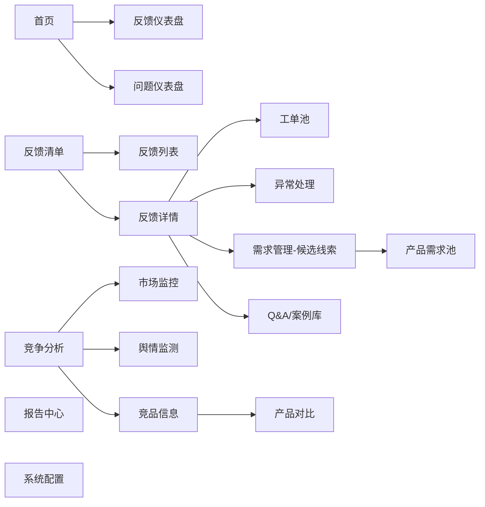
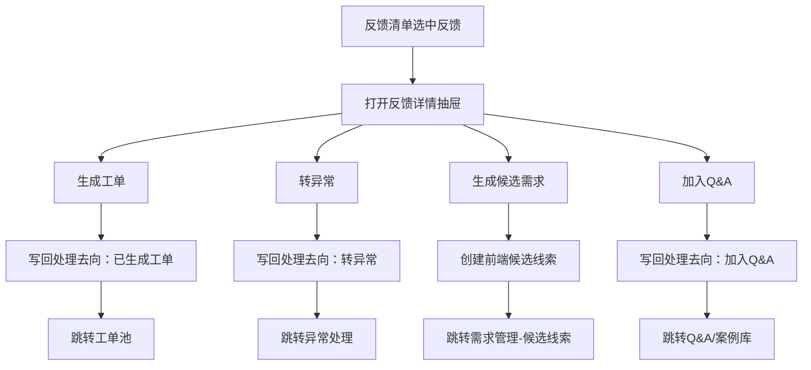
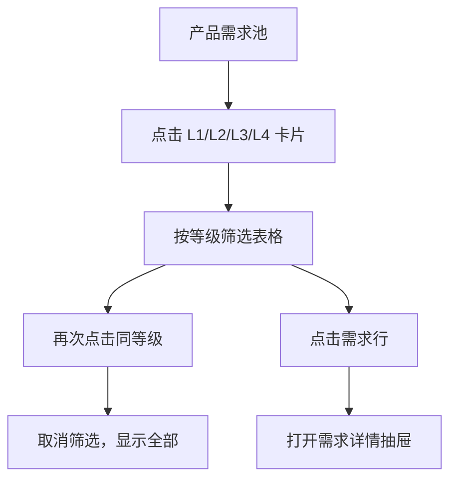
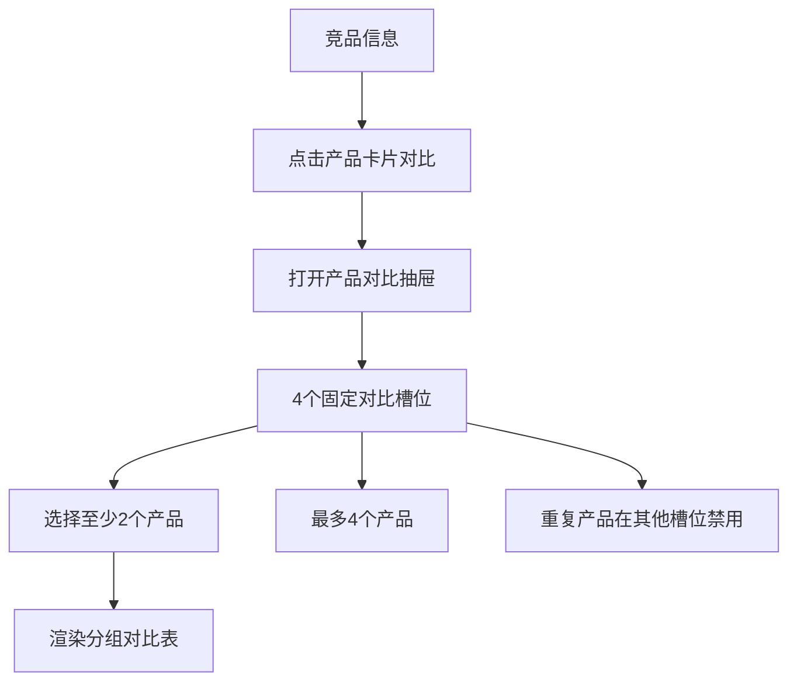

# 反馈管理系统 PRD（V1.1 原型校准版）

版本：V1.1  
日期：2026-06-12  
项目目录：`/Users/handy/codex/produce_iteration_system`  
原型目录：`/Users/handy/codex/produce_iteration_system/feedback-management-prototype`  
校准原则：本版以当前最新原型界面和 `feedback-management-prototype/src/App.jsx` 中实际实现的页面、字段、交互为准；需求说明书、流程 Excel 中尚未落到原型里的内容统一放入“目标系统/后续待实现”。

## 1. 文档目的

本文档用于描述“反馈管理系统 MVP 原型”的真实产品逻辑，重点说明当前原型已经展示的页面结构、用户操作路径、数据对象关系和系统对接边界。

与 V1.0 相比，本版修正两类问题：

1. 不再把需求说明书中的完整目标能力直接写成当前原型已实现能力。
2. 对每个模块明确区分“当前原型已实现”和“后续系统化实现”。

## 2. 当前原型范围

当前原型是一个前端静态/半交互 MVP，用于评审信息架构、页面布局、字段设计和关键业务流转。原型内的数据来自前端模拟数据，不代表已经完成真实后端、数据库、接口、权限和持久化。

当前导航模块：

| 模块 | 当前原型状态 |
|---|---|
| 首页 | 已实现筛选栏、反馈仪表盘、问题仪表盘、趋势图和若干看板 |
| 反馈清单 | 已实现列表、字段筛选、快速分类、详情抽屉和处理去向跳转 |
| 工单池 | 已实现流程条和工单表格展示，暂未实现新增/编辑/详情闭环 |
| 异常处理 | 已实现流程条和异常表格展示，暂未实现异常详情处置流 |
| 需求管理 | 已实现候选线索/产品需求池双页签、等级筛选、需求详情抽屉 |
| 竞争分析 | 已实现市场监控、舆情监测、竞品信息和产品对比 |
| 报告中心 | 当前为占位模块 |
| Q&A/案例库 | 当前为占位模块 |
| 系统配置 | 当前为占位模块 |

## 3. 业务定位

反馈管理系统定位为产品快速优化迭代体系中的前端数据入口和反馈分析协同平台。系统承接来自用户反馈、退货原因、平台评价、售后沟通、APP 反馈、市场变化和竞品动态的信息，辅助产品经理、运营、售后、研发、质量和供应链识别问题、分流处理、沉淀证据并生成候选需求。

当前 MVP 原型重点验证：

1. 反馈数据能否按来源、产品、分类、情绪、退货、异常建议进行统一查看。
2. 反馈详情能否分流到工单、异常、候选需求和 Q&A。
3. 需求管理是否能承接“候选线索 -> 产品需求池 -> 五维评分 -> L1-L4分级”的前置管理。
4. 竞争分析是否能按市场监控、舆情监测、竞品信息三个视角支撑需求机会识别。
5. 首页是否能提供业务与质量两个维度的管理看板。

## 4. 一期/二期边界

### 4.1 当前原型已覆盖的一期 MVP 边界

| 能力 | 当前原型表现 |
|---|---|
| 反馈数据池 | 反馈清单展示模拟反馈数据，含来源、站点、品牌、型号、原文、AI摘要、三级分类、情绪、退货和异常建议 |
| AI处理结果展示 | 原型展示 AI 摘要、AI 翻译、分类建议、情绪和异常建议，但 AI 本身未真实接入 |
| 处理去向 | 反馈详情支持生成工单、转异常、生成候选需求、加入 Q&A，并写回当前前端状态 |
| 工单池 | 展示工单处理流程和工单列表 |
| 异常处理 | 展示 P 级异常处理流程和异常列表 |
| 需求管理 | 展示候选线索、产品需求池、五维评分、L1-L4等级筛选和需求详情 |
| 竞争分析 | 展示市场监控、舆情监测、竞品档案、产品详情和最多 4 个产品对比 |
| 仪表盘 | 展示反馈仪表盘和问题仪表盘，支持全局筛选影响部分指标展示 |
| 占位模块 | 报告中心、Q&A/案例库、系统配置为模块边界展示 |

### 4.2 后续系统化实现边界

| 能力 | 后续实现说明 |
|---|---|
| 数据持久化 | 当前前端状态需落库，反馈、工单、异常、需求、竞品均需有数据库对象 |
| 真实 AI 服务 | 翻译、摘要、分类、去重、异常建议、需求建议需接入 AI 服务并记录置信度 |
| 真实接口同步 | ERP/PMS/APP/卖家精灵/飞书/群机器人需实现任务调度、失败重试和同步日志 |
| 权限系统 | 当前原型未实现登录、角色、数据范围控制 |
| 审批与下游系统 | 需求审批、事件管理、项目管理、计划管理、生产管理为接口预留或二期深化 |
| 报告生成 | 当前报告中心为占位，后续需生成周报、月报和导出能力 |

## 5. 信息架构

## 6. 首页

### 6.1 当前原型已实现

首页包含全局筛选栏、页签切换和两类仪表盘。

全局筛选栏：

| 筛选项 | 当前选项 |
|---|---|
| 时间周期 | 今日、近7天、近30天、近90天、自定义 |
| 站点 | 全部站点、Amazon.com (US)、天猫、京东、抖音 |
| 品牌 | 全部品牌、云康宝、AF、GE、LF |
| 产品类型 | 全部产品类型、体脂秤、人体秤、八电极秤、筋膜枪、按摩产品 |
| 销售型号 | 全部、CS20A、CS30B、BF511、MG20、MS30 |
| 来源渠道 | 全部、商品评论、退货原因、站内信、客服沟通、APP反馈、社媒、Vine、天使用户、投诉/警告 |

首页页签：

- 反馈仪表盘
- 问题仪表盘

对比维度：

- 环比
- 同比

反馈仪表盘当前展示：

- 指标卡：退货率、反馈率、闭环率、响应达成率、异常占比、差评率。
- 关键指标趋势：标题跟随时间周期变化，如“关键指标趋势（近30天）”。
- 产品型号表现 TOP10。
- 退货率 vs 反馈率（按产品类型）。

问题仪表盘当前展示：

- 一级反馈分类。
- 二级反馈分类。
- 三级反馈分类。
- 前5大三级反馈比例对比。
- 紧急异常动态（近24小时），可跳转异常处理。
- TOP质量问题（按占比）。
- 质量改善动作看板，可跳转工单池。

### 6.2 后续待实现

- 真实指标计算口径。
- 图表数据按筛选条件实时查询。
- 指标说明弹层。
- 同比/环比切换真正影响图表和卡片数据。
- 首页快捷入口和异常提醒与真实工单/异常状态联动。

## 7. 反馈清单

### 7.1 当前原型已实现

反馈清单定位为“原始反馈数据池与 AI 分类结果总览”，不是工单池。

顶部工具：

- 搜索反馈ID、ASIN、型号、原文关键词。
- 新增反馈按钮。
- 批量导入按钮。
- 同步按钮。
- 同步摘要：同步时间、新增数量。

顶部汇总：

- 反馈总数。
- 反馈率。
- 差评率（1-2星）。
- 退货率。
- AI去重合并率。
- 已转工单数。

反馈列表字段：

| 字段 | 当前表现 |
|---|---|
| 反馈ID | 支持新增绿色点标识，点击行打开详情 |
| 来源渠道 | 商品评论、退货原因、APP反馈、站内信、投诉/警告等 |
| 品牌/站点/产品类型/销售型号/内部型号 | 表格展示并支持列筛选 |
| ASIN/SKU | 表格展示 |
| 原始反馈摘要 | 展示英文原文摘要 |
| AI摘要 | 展示中文摘要 |
| 一级/二级/三级分类 | 行内下拉快速调整 |
| 情绪 | 行内下拉，负面/中性/正面 |
| 是否退货 | 行内下拉，是/否 |
| 异常等级建议 | 行内下拉，无、P1建议、P2建议、P3建议 |
| 处理去向 | 只读展示，由详情动作写回 |
| 反馈时间 | 表格展示 |

反馈详情抽屉：

- 处理步骤：已采集、AI处理、分类确认、生成工单、处理中、待确认、已闭环。
- 页签外观：详情、处理记录、关联信息、附件证据。
- 展示原始反馈、AI翻译、AI摘要、分类、情绪、退货、异常建议、来源渠道、品牌、站点、产品信息、证据链接。

详情动作：

| 动作 | 当前前端逻辑 |
|---|---|
| 生成工单 | 写回处理去向为“已生成工单”，跳转工单池 |
| 转异常 | 写回处理去向为“转异常”，跳转异常处理 |
| 生成候选需求 | 创建候选需求线索，切换到需求管理的候选线索页签 |
| 加入Q&A | 写回处理去向为“加入Q&A”，跳转 Q&A/案例库 |

### 7.2 后续待实现

- 新增反馈、批量导入、同步按钮需接入真实功能。
- 处理记录、关联信息、附件证据页签需有真实内容。
- 生成工单、转异常、加入 Q&A 需创建真实对象并持久化。
- 列筛选、快速分类修改需保存到后端，并记录人工修正历史。
- AI 分类建议需有置信度、版本和人工修正记录。

## 8. 工单池

### 8.1 当前原型已实现

工单池当前为列表展示页，包含：

- 页面说明：从反馈清单生成的处理协同事项，按 SLA 进行分派、跟进和闭环。
- 工单处理流程条：生成工单、分派责任人、处理中、待确认、已闭环。
- 工单表格。

当前表格字段：

- 工单ID。
- 关联反馈。
- 处理状态。
- 当前处理人。
- 责任部门。
- SLA剩余时间。
- 处理结果。
- 关闭原因。
- 转异常。
- 转需求池。

### 8.2 与 V1.0 的校正

当前原型尚未实现工单详情抽屉、工单编辑、分派、批量操作、SLA倒计时实时刷新、关闭校验等完整闭环。因此这些能力应归入后续实现，而不是当前原型能力。

### 8.3 后续待实现

- 从反馈详情真正创建工单记录。
- 工单详情页或侧滑抽屉。
- 分派责任人、转交、处理记录、附件、关闭原因。
- SLA 倒计时、超时提醒、升级提醒。
- 工单转异常、转候选需求的真实对象创建。

## 9. 异常处理

### 9.1 当前原型已实现

异常处理当前为列表展示页，包含：

- 页面说明：引用外贸电商异常级别判定标准，支持 P0-P3 响应时效、升级路径和归档。
- 异常处理流程条：异常识别、P级判定、升级通知、处置方案、执行跟进、验证关闭、案例归档。
- 异常表格。

当前表格字段：

- 异常ID。
- P级。
- 判定维度。
- 触发来源。
- 响应时效。
- 升级路径。
- 状态。
- 异常问题。
- 强制/建议动作。

### 9.2 异常等级规则

异常等级沿用《外贸电商异常级别判定标准V1.0》：

| 等级 | 响应时效 | 方案时效 | 处理模式 |
|---|---|---|---|
| P0 | 30分钟内响应 | 6小时内出方案 | 立即执行 |
| P1 | 2小时内响应 | 24小时内出方案 | 紧急处理 |
| P2 | 6小时内响应 | 72小时内出方案 | 标准SOP |
| P3 | 24小时内响应 | 常规处理 | 常规流程 |

### 9.3 后续待实现

- 异常详情页。
- 根因分析、临时处置、整改方案、验证结果、关闭记录。
- P0/P1 强提醒和升级通知。
- 异常转候选需求或事件管理系统。
- 异常案例自动归档。

## 10. 需求管理

### 10.1 当前原型已实现

需求管理包含两个页签：

- 候选线索。
- 产品需求池。

候选线索当前字段：

- 线索ID。
- 来源反馈。
- 分类。
- 线索标题。
- 证据摘要。
- 适用产品。
- 状态。
- 下一步动作。

候选线索当前操作按钮：

- 合并。
- 补证据。
- 进入评分。

说明：当前这些按钮主要用于表达流程方向，尚未实现真实合并、补证据表单或评分流转。

产品需求池当前能力：

- 顶部 L1-L4 卡片。
- 点击等级卡片可筛选对应等级需求，再次点击取消筛选。
- 产品需求池表格。
- 点击需求行打开需求详情抽屉。

产品需求池字段：

- 需求ID。
- 候选来源。
- 需求标题。
- 来源/证据。
- 适用产品。
- 五维评分。
- 等级。
- 处理路径。
- 状态。
- 责任人。
- 完成时限。

需求详情抽屉：

- 流程条：候选导入、信息补齐、五维评分、L级分级、审批/评审、下游立项、复盘回写。
- 字段：候选来源、需求等级、处理路径、当前状态、责任人、完成时限。
- 文本块：需求描述、用户痛点、来源与证据、适用产品、预期价值、风险与待确认、下一步动作、关联记录、分级说明。
- 五维评分条：用户价值、业务影响、可行性、竞争影响、库存影响。
- 底部按钮：进入审批、退回补充、加入观察池。

说明：底部按钮目前是界面表达，尚未实现审批状态变更。

### 10.2 当前前端状态联动

反馈详情中点击“生成候选需求”时，当前原型会：

1. 基于当前反馈生成一个候选线索对象。
2. 插入候选线索列表顶部。
3. 将需求管理页签切换为“候选线索”。
4. 将反馈的处理去向写为“已生成需求线索”。

这属于前端内存状态联动，刷新页面后不会持久保留。

### 10.3 后续待实现

- 候选线索合并规则。
- 补证据表单。
- 五维评分录入与多人评分。
- 需求等级自动建议和人工确认。
- 审批流、退回补充、观察池、关闭逻辑。
- 与现有需求池的导入或 API 对接。
- 需求状态从下游系统回写。

## 11. 竞争分析

### 11.1 当前原型已实现

竞争分析包含三个页签：

- 市场监控。
- 舆情监测。
- 竞品信息。

顶部有同步按钮，但当前未接真实同步功能。

### 11.2 市场监控

当前展示：

- KPI：监控平台、分析对象、价格异动、上新/卖点变化。
- 关键词/排名变化。
- 市场触发提醒。
- 跨平台竞品动态表格。

跨平台竞品动态字段：

- 平台。
- 品牌。
- 产品。
- 类别。
- 排名。
- 价格。
- 评分。
- 评论数。
- 变化。
- 事件。
- 触发。
- 建议动作。

“生成分析任务”目前是按钮展示，尚未实现任务创建。

### 11.3 舆情监测

当前展示：

- 本周 AI 舆情采集概览：任务、成功、失败、商品、新增评论、平均星级。
- 采集条件：品牌、产品、来源、关键词、采集频率。
- 星级分布。
- 正向观点 Top。
- 负向观点 Top。
- 未满足需求。
- 典型评论与媒体线索。

“配置采集条件”目前是按钮展示，尚未实现配置表单。

### 11.4 竞品信息

当前结构：

- 左侧/主区域为竞品产品卡片。
- 顶部按类别筛选：全部、八电极秤、体脂秤、筋膜枪等。
- 右侧为竞品产品信息详情面板，可关闭。
- 产品卡片上有“对比/已选”按钮。
- 打开对比后出现产品对比抽屉。

产品卡片展示：

- 竞品类型。
- 品牌 + 产品名称。
- 产品类型 / 定位。
- 到手价。
- 平台。
- 核心卖点。

详情面板展示：

- 竞品类型、产品类型、产品定位、上市时间、销售平台、销售区域、官方售价、到手价。
- 核心卖点。
- 规格分组。
- 用户痛点。

### 11.5 产品对比

当前最新原型逻辑：

- 点击产品卡片“对比”后打开右侧产品对比抽屉。
- 最多支持 4 个产品。
- 对比抽屉顶部显示“已选 X/4 个产品”。
- 对比选择区是 4 个固定槽位，每个槽位一个下拉框。
- 已选产品在其他槽位下拉框中禁用，避免重复选择。
- 选择至少 2 个产品后显示对比表。

对比表当前分组：

- 基础档案。
- 价格与评价。
- 硬件规格。
- 测量与算法或功能能力。
- 连接与数据。
- 包装售后与证据。
- 痛点与风险。

字段生成逻辑：

- 基础档案和价格评价来自竞品产品主数据。
- 规格字段来自 `getCompetitorSpecSections(product)`。
- 不同品类字段不一致时，不适用字段显示“不适用”，缺失字段显示“待补充”。

### 11.6 后续待实现

- 卖家精灵 API 数据接入。
- 竞品 ASIN 档案新增/编辑。
- 价格、BSR、评分、评论数、关键词排名的真实趋势图。
- 舆情采集任务配置。
- 竞品分析任务创建。
- 竞品机会转候选需求。
- 产品对比字段维护和证据链接管理。

## 12. 报告中心

### 12.1 当前原型已实现

当前为占位模块，展示模块边界和四类报告入口：

- 用户反馈周/月报。
- 竞争分析周/月报。
- 异常统计分析。
- 有效信息转需求清单。

### 12.2 后续待实现

- 报告生成条件选择。
- 报告模板。
- AI 报告初稿。
- 导出 Markdown、Excel、PDF 或飞书文档。
- 周报/月报定时推送。

## 13. Q&A/案例库

### 13.1 当前原型已实现

当前为占位模块，展示：

- 常见问题标准回复。
- 异常案例归档。
- 产品使用视频指引。
- 客服培训材料。

反馈详情点击“加入Q&A”会跳转到该模块，并把反馈处理去向改为“加入Q&A”，但尚未创建真实 Q&A 记录。

### 13.2 后续待实现

- Q&A 条目创建、编辑、审核。
- 从已闭环工单/异常生成案例。
- 适用产品线、站点、语言版本管理。
- 客服话术和对外回复审核。

## 14. 系统配置

### 14.1 当前原型已实现

当前为占位模块，展示配置项边界：

- 渠道管理。
- 分类标签。
- 产品线/型号。
- 角色权限。
- SLA规则。
- 卖家精灵API配置。

### 14.2 后续待实现

- 配置表单。
- 权限和数据范围。
- 分类标签维护。
- 同步任务配置。
- AI 提示词、模型和置信度阈值配置。
- 配置变更审计日志。

## 15. 当前原型数据对象

| 对象 | 当前用途 | 是否持久化 |
|---|---|---|
| `feedbackRows` | 反馈清单模拟数据 | 否 |
| `ticketRows` | 工单池模拟数据 | 否 |
| `exceptionRows` | 异常处理模拟数据 | 否 |
| `requirementRows` | 产品需求池模拟数据 | 否 |
| `initialCandidateLeads` / `candidateLeads` | 候选需求线索，支持前端新增 | 否 |
| `competitorMarketRows` | 市场监控表格模拟数据 | 否 |
| `competitorSentiment` | 舆情监测模拟数据 | 否 |
| `competitorProducts` | 竞品信息和产品对比模拟数据 | 否 |
| `filters` | 首页和反馈清单筛选状态 | 否 |
| `activePage` / `activeTab` | 页面导航和页签状态 | 否 |

## 16. 当前关键前端状态流

### 16.1 反馈分流

### 16.2 需求管理筛选

### 16.3 竞品产品对比

## 17. 系统对接设计边界

### 17.1 当前原型状态

当前原型没有真实外部接口。同步、生成任务、导出、配置等按钮均为界面表达或后续入口。

### 17.2 目标系统对接

| 外部对象 | 一期目标 | 当前原型表现 |
|---|---|---|
| ERP/订单/退货 | 获取订单、销量、退货、售后基础数据 | 仅用模拟字段展示 |
| APP反馈系统 | 获取 APP 反馈、App版本、错误码、日志 | 仅有 APP反馈来源样例 |
| 卖家精灵 API | 获取竞品、价格、评分、评论、BSR、关键词、促销 | 竞争分析中以模拟数据展示 |
| 飞书文档/多维表格 | 输出报告、需求清单、异常跟踪 | 未实现 |
| 群机器人 | 推送异常提醒、超时提醒、报告摘要 | 未实现 |
| 现有需求池 | 导入候选需求并回写需求状态 | 原型仅展示“产品需求池”前端表格 |
| 事件/项目/计划/生产系统 | 二期联动 | 未实现 |

## 18. AI 能力边界

### 18.1 当前原型表现

当前原型展示 AI 处理结果字段，包括：

- AI 摘要。
- AI 翻译。
- 情绪。
- 三级分类建议。
- 异常等级建议。
- AI 舆情采集概览。

这些是模拟结果，不代表已经接入真实 AI 服务。

### 18.2 后续实现要求

- AI 输出必须保留原始输入、模型版本、提示词版本、置信度和生成时间。
- AI 分类、异常建议、需求建议必须允许人工修正。
- AI 不自动关闭工单、不自动定责、不自动生成对外回复。
- 关键结论必须人工确认。

## 19. 当前原型与目标系统差异清单

| 主题 | 当前原型 | 目标系统 |
|---|---|---|
| 数据来源 | 前端模拟数据 | 多系统接口、手工录入、批量导入 |
| 数据保存 | 前端内存状态 | 数据库持久化 |
| 反馈处理 | 可跳转和写回处理去向 | 创建真实工单、异常、候选需求、Q&A |
| 工单池 | 流程条 + 表格展示 | 完整分派、处理、确认、关闭、SLA |
| 异常处理 | 流程条 + 表格展示 | 根因、整改、验证、升级、归档 |
| 需求管理 | 候选线索和需求池展示，部分前端联动 | 评分、审批、导入、状态回写 |
| 竞争分析 | 三页签展示和产品对比 | 卖家精灵数据、趋势、任务、转需求 |
| 报告中心 | 占位 | 报告生成、导出、推送 |
| Q&A/案例库 | 占位 | 条目维护、审核、复用 |
| 系统配置 | 占位 | 分类、权限、SLA、接口、AI配置 |
| 权限 | 未实现 | 角色 + 数据范围 |

## 20. MVP 验收建议

### 20.1 原型评审验收

| 模块 | 验收点 |
|---|---|
| 首页 | 筛选栏、反馈/问题仪表盘切换、图表和指标展示清晰 |
| 反馈清单 | 列表字段完整，行内分类和处理去向逻辑清晰 |
| 反馈详情 | 四类分流动作符合业务理解 |
| 工单池 | 字段能表达工单协同最小闭环 |
| 异常处理 | P级、响应时效、升级路径、动作表达清楚 |
| 需求管理 | 候选线索和产品需求池边界清楚，五维评分和等级筛选可理解 |
| 竞争分析 | 市场/舆情/竞品信息三页签结构合理，产品对比可用 |
| 占位模块 | 报告中心、Q&A、系统配置边界明确 |

### 20.2 系统开发验收

系统开发阶段需另行补充接口文档、数据库设计、权限规则、同步任务设计、AI 服务设计和真实验收用例。

## 21. 待确认事项

| 待确认项 | 说明 |
|---|---|
| 当前 MVP 是否先做前端原型评审，还是进入后端设计 | 决定 PRD 下一版是否拆出接口和数据库详细设计 |
| 工单池是否需要在一期做完整闭环 | 当前原型只是展示页 |
| 异常处理是否纳入一期真实闭环 | 当前原型只是展示页 |
| 需求管理是否只做导入清单，还是接管完整需求池 | 当前原型展示了产品需求池，但项目规则强调不替代现有需求池 |
| 卖家精灵 API 首批接口范围 | 影响竞争分析真实开发范围 |
| 报告中心一期是否必须开发 | 当前为占位模块 |
| Q&A/案例库是否一期纳入 | 当前为占位模块 |
| 权限系统一期是否必须上线 | 当前未实现 |
